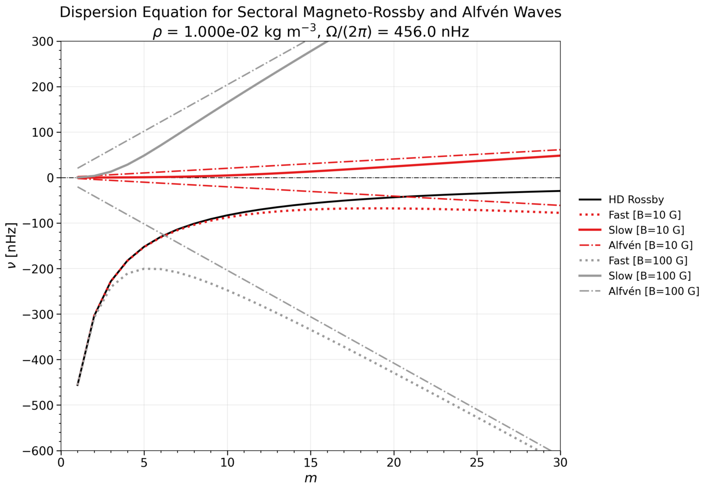

# Magneto-Rossby Dispersion Dashboard

An interactive Streamlit app for visualizing the sectoral dispersion curves of hydrodynamic Rossby waves, fast/slow magneto-Rossby waves, and Alfvén waves as a function of azimuthal order *m* and magnetic field strength *B*.

The dispersion relations implemented here follow [Zaqarashvili, Oliver, Ballester & Shergelashvili (2007)](https://www.aanda.org/articles/aa/abs/2007/30/aa7382-07/aa7382-07.html), with Alfvén and Hydrodynamical (HD) Rossby branches included for reference.



---

## Features

- **Interactive controls**: adjust rotation rate (Ω), solar radius (R), density (ρ), azimuthal order range (m), and one or more magnetic field strengths (B) via the sidebar.
- **Three wave families** plotted simultaneously: HD Rossby baseline, fast and slow magneto-Rossby branches (Eq. 44), and Alfvén branches (±).
- **B presets** for quick exploration or a custom comma-separated list.
- **Axis sliders** to zoom into any region of *m*–ν space.
- **Tabular data view** and **CSV download** of all plotted curves.

---

## Physics Background

The app solves the quadratic spherical dispersion relation for sectoral magneto-Rossby waves (Eq. 44 of Zaqarashvili et al. 2007):

$$n(n+1)\,x^2 + x + \alpha^2\bigl[2 - n(n+1)\bigr] = 0, \quad x = \lambda/s$$

where:
- *s* = *n* = *m* for sectoral modes
- λ is the dimensionless eigenvalue related to mode frequency by ν = 2Ω λ
- α = v_A / (2Ω R₀) is the dimensionless magnetic parameter
- v_A = B / √(μ₀ ρ) is the Alfvén speed

The two roots correspond to the **fast** (closer to the HD Rossby branch) and **slow** magneto-Rossby branches. The **Alfvén** frequency is given by ν_A = (m / R₀) v_A / 2π. In the limit α → 0, the slow branch recovers the purely hydrodynamic Rossby dispersion relation.

Some notes: (1) density (ρ) has a large effect on the Alfvén speed (and thus α); (2) for very large B or low ρ, the slow magneto-Rossby branch can depart significantly from the HD Rossby baseline; (3) the Alfvén branches are symmetric about ν = 0; only the prograde branch is labeled in the legend to avoid duplication; and (4) all frequencies are in nHz, consistent with helioseismology conventions.


---

## Quickstart

### Run locally

```bash
pip install -r requirements.txt
streamlit run dashboard_magnetorossby.py
```

### View online

[https://magneto-rossby-dashboard.streamlit.app/](https://magneto-rossby-dashboard.streamlit.app/)

---
